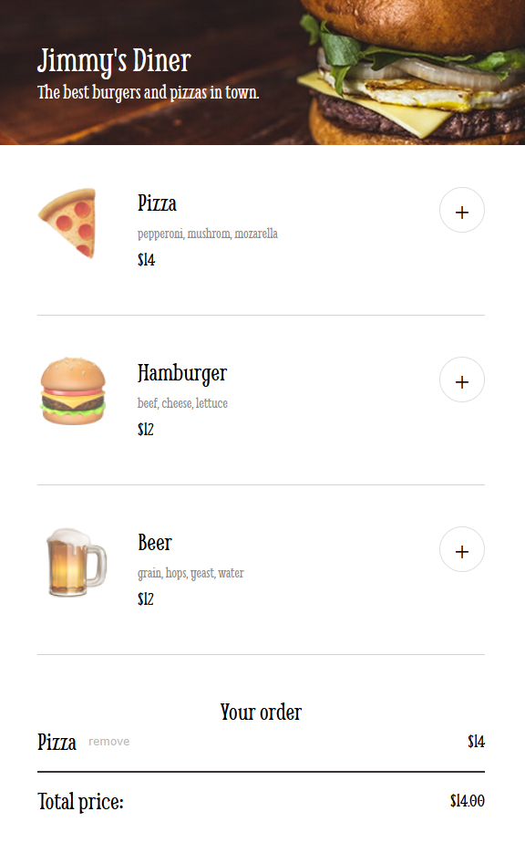

# Jimmy's Diner 🧾🍔

A simple restaurant ordering web app built with HTML, CSS, and JavaScript.  
This was a solo practice project based on a Scrimba Frontend Developer Career Path challenge.

Live demo [here](https://restaurant-app-by-pedro-silva.netlify.app/)

 <!-- Optional: Add screenshot of the app UI -->!

---

## 📋 Features

- 🔘 Dynamically rendered menu using JavaScript
- ➕ Add/remove menu items to/from the cart
- 💳 Checkout modal with form validation (name, card number, CVV)
- ✅ Simulated order confirmation message
- 🧼 Clean and modular code
- 🧠 No frameworks — built with vanilla JS, HTML, and CSS

---

## 🎯 Project Goals

This project followed a [Figma](https://scrimba.com/links/solo-project-restaurant-menu-figma) design file provided by Scrimba.  
Requirements fulfilled:

- [x] Follow the given design spec  
- [x] Render menu items dynamically with JavaScript  
- [x] Enable adding and removing items from the cart  
- [x] Implement a modal form for payment with compulsory fields

---

## 🚀 Technologies Used

- HTML5
- CSS3
- JavaScript (ES6)
- Figma (for the UI design)
